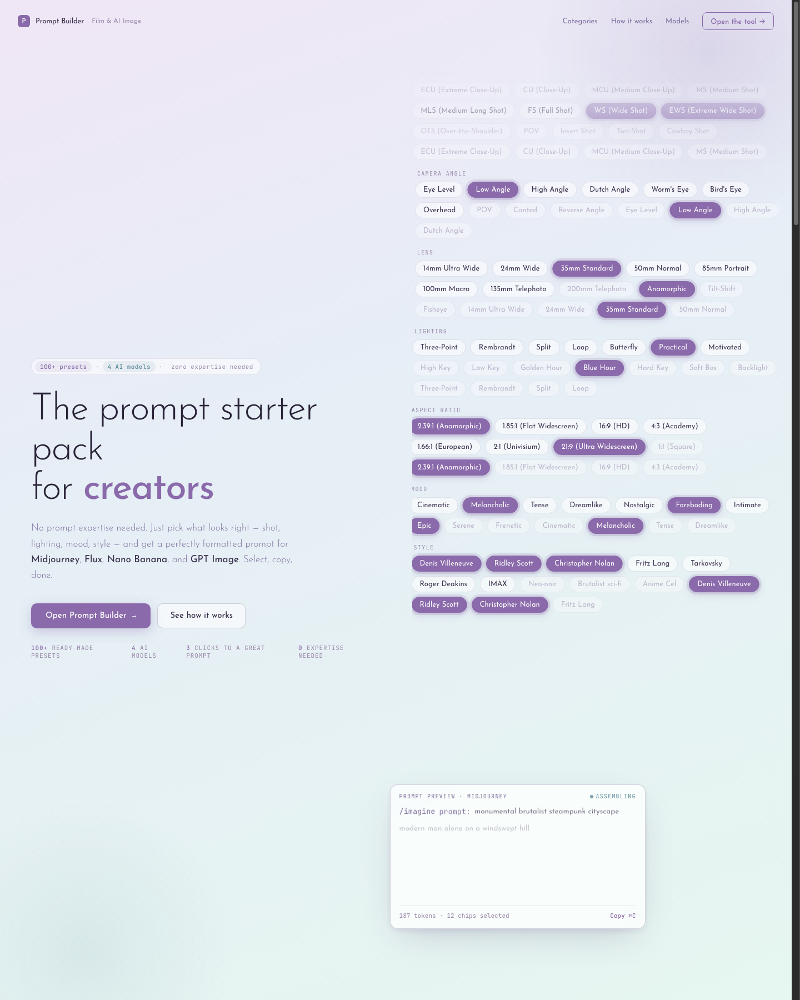
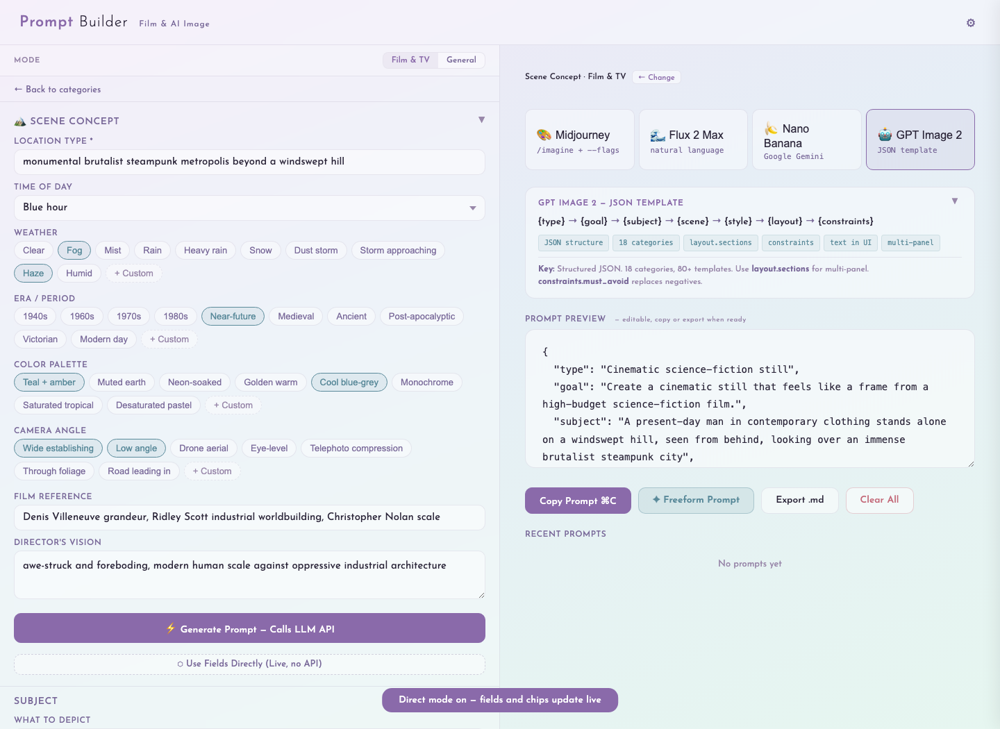
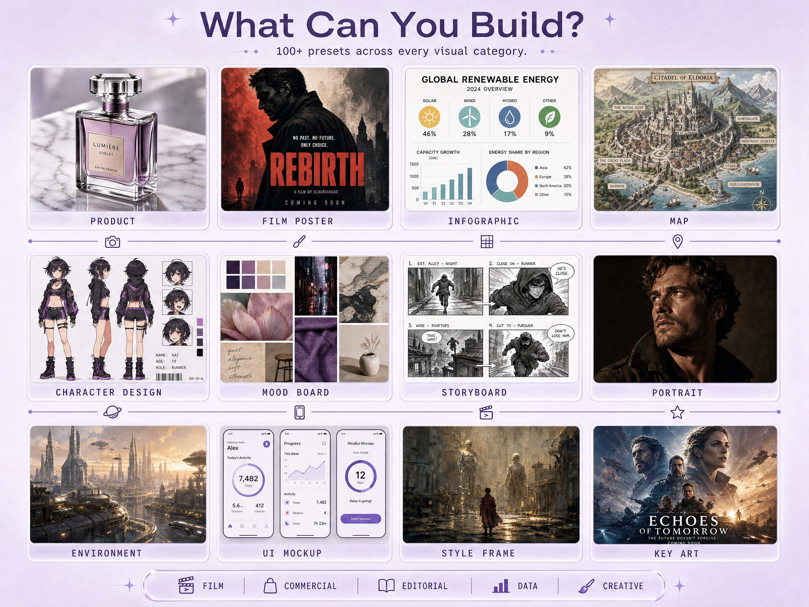
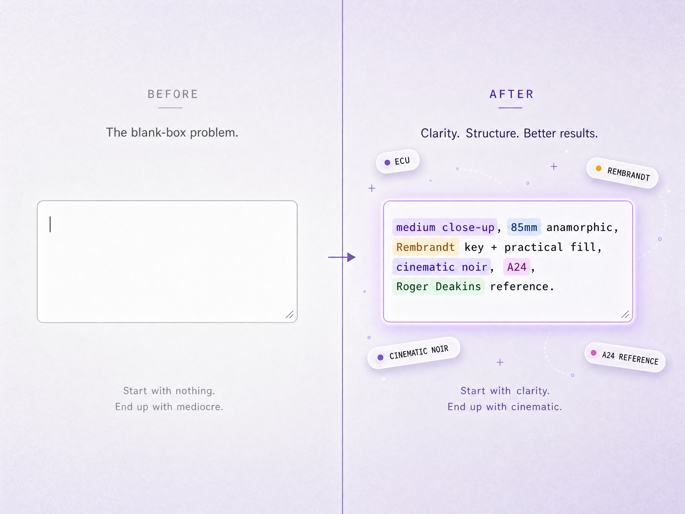
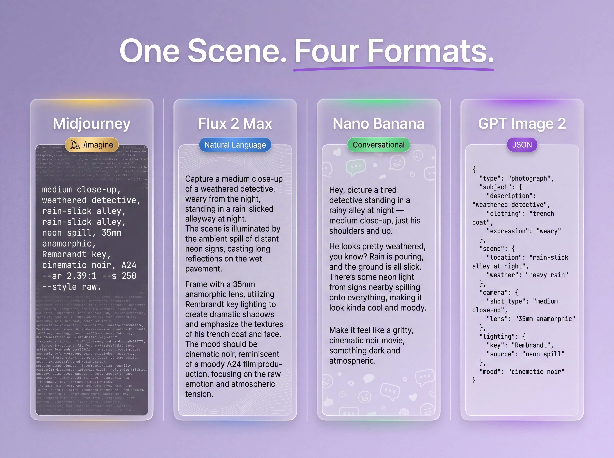

# Prompt Builder — Prompt in Shot Language

[](https://github.com/ericzheng-lab/prompt-builder/stargazers)
[](#)
[](#)
[](#)

> A production-minded prompt builder for AI image generation. Pick what you want to make, choose real film/visual language, and copy a model-ready prompt for Midjourney, Flux, Nano Banana, or GPT Image.

> **[→ Live demo](https://ai.drsfilms.com/prompt-builder/)** — no install, no account, just open.



## The Short Version

Prompt Builder turns production knowledge into usable AI image prompts.

Instead of asking users to memorize prompt syntax, it gives them a visual workflow:

1. Choose what they are making.
2. Select presets, fields, and chips.
3. Copy a prompt already formatted for the image model they use.

It is a static, installable PWA. No account. No backend. No setup. LLM enhancement is optional.

## Install From GitHub

Launch once with GitHub + `npx`:

```bash
npx --yes github:ericzheng-lab/prompt-builder
```

Or install a persistent local command:

```bash
curl -fsSL https://raw.githubusercontent.com/ericzheng-lab/prompt-builder/main/install.sh | bash
prompt-builder
```

Both paths start the app on `localhost` and keep the PWA install flow intact. After the browser opens, use the browser install button to keep Prompt Builder as a desktop app.

For local testing from this folder:

```bash
bash install.sh
prompt-builder
```

## Why This Exists

AI image tools are powerful, but the input layer is still awkward.

A cinematographer thinks in `epic wide shot`, `35mm anamorphic`, `blue-hour industrial glow`, `teal-and-amber grade`, `man small in frame for scale`. Most prompt tools ask them to type into a blank box.

Prompt Builder closes that gap. It translates film and visual-production language into model-specific AI prompts.

## What Makes It Different

- **Built around real production vocabulary**: shot size, camera angle, lens, lighting, mood, style, aspect ratio, key art, panoramas, turnarounds, storyboards.
- **Model-aware output**: Midjourney gets `/imagine` syntax, Flux gets natural language, Nano Banana gets conversational direction, GPT Image gets structured JSON.
- **Use fields directly**: no LLM required. Fields, chips, and model params update the preview live.
- **Optional AI enhancement**: add an API key only when you want an LLM to expand a structured idea.
- **Installable PWA**: works as a lightweight creative utility users can keep on their desktop.



## Product Walkthrough

### Pick a workflow

Film and visual categories are organized by intent: mood board, style frame, character turnaround, panorama, scene concept, storyboard, key art, product visual, infographic, UI mockup, and more.



### Build in familiar language

Users select from curated chips and fields instead of writing from scratch.



The showcase images use the source prompts documented in `Prompt_USED_CASES`.

### Output to the right model

The same creative intent can be formatted four ways:



| Model | Output Style | Best For |
| --- | --- | --- |
| Midjourney | `/imagine prompt: ... --ar ... --style raw` | cinematic stills, art direction, mood images |
| Flux 2 Max | natural language + params | detailed controllable image descriptions |
| Nano Banana | conversational direction | fast ideation and photographer-style prompting |
| GPT Image | structured JSON | layouts, panels, diagrams, controlled compositions |

## Who It Is For

- Directors, DPs, production designers, storyboard artists, and visual creators.
- AI image users who know what they want visually but do not want to become prompt engineers.

## Why It Matters

Prompt Builder is not just a preset pack. It is a small product thesis:

> The next wave of AI tools will not only make models stronger. They will make expert workflows easier to express.

The goal is simple: help more people skip the prompt-writing headache and get straight to creating.

## Try It

> **If this saves you time, a star goes a long way.** It helps other creators find the tool and keeps the project moving.

- Open `index.html` for the landing page.
- Open `prompt-builder.html` for the tool.
- Run `npx --yes github:ericzheng-lab/prompt-builder` for a GitHub CLI launch.
- Run `bash install.sh`, then `prompt-builder`, for the local CLI install.
- Publish the folder with GitHub Pages to make it installable as a PWA.

<a href="https://github.com/ericzheng-lab/prompt-builder">View source on GitHub</a>

## Launch Materials

- `install.sh`: one-command local installer for a GitHub-style CLI launch.
- `package.json` + `bin/prompt-builder.js`: `npx github:...` launch path.
- `release-package/docs/DESIGN.md`: product and design philosophy for investors, hiring teams, and LinkedIn.
- `release-package/docs/LINKEDIN_POSTS.md`: ready-to-edit launch posts for different audiences.
- `release-package/docs/PRESS_KIT.md`: short descriptions, positioning, demo talking points, and asset checklist.
- `release-package/social-cards/`: 1200 x 630 post-card layouts and rendered launch images.
- `release-package/docs/LAUNCH_CHECKLIST.md`: GitHub Pages, PWA, social preview, and launch-day checklist.

## Tech

- Static HTML/CSS/JavaScript
- PWA manifest + service worker
- No backend
- Optional API calls for LLM enhancement
- Works from GitHub Pages

## Author

Built by **Eric Zheng** — 15-year film producer (Sundance Grand Jury Prize nominee, Berlinale Panorama, $8M+ commercial portfolio at Final Frontier). Now building AI-native production tools at [DRS Films](https://ai.drsfilms.com).

The point of this project is simple: make AI image generation feel less like prompt hacking and more like directing.
